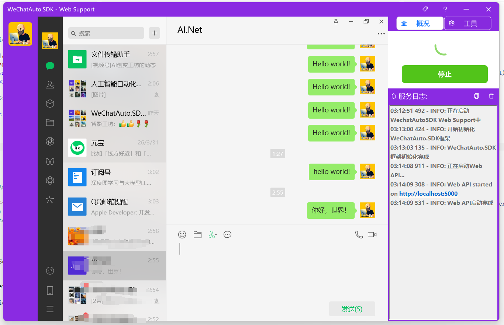

# WebChatAuto.SDK Web Support介绍

WeChatAuto.SDK 原本为一个 SDK 形式的微信自动化工具库。

当前版本在 SDK 基础之上，提供了一个 可视化 UI + REST API 服务，方便用户通过 HTTP 接口实现微信自动化操作,考虑到微信风控的因素，系统对于待发送消息做了“池化”操作，所以适用于批量发送大量消息的场景，这意味着使用者尽管发送消息，不用考虑消息太多，操作频繁而被退出的情况。

启动后，系统会在本地启动一个 Web API 服务，开发者或其他程序可以通过发送 HTTP 请求，实现自动化控制微信客户端。

**注意**: 下载的Release文件为微信```3.9.12.xx```客户端版本，请确保你本机的微信客户为```3.9.12.xx```版本




**源码:** [WechatAuto.SDK Web Support](https://github.com/scottfly189/WeChatAuto.SDK/tree/master/WeChatAutoWebSupport/WeChatAutoSDK_WebSupport)

**直接下载:** [直接下载](https://github.com/scottfly189/WeChatAuto.SDK/releases/tag/1.2.8)
> 直接下载的已经包含.net10运行时，不需要安装.net环境

## 二、功能特性

当前版本已支持以下能力：

- ✅ 发送文本消息（好友 / 群）
- ✅ 发送图片消息
- ✅ 发送文件消息
- ✅ 基于 REST API 的自动化调用
- ✅ 本地 UI 控制（启动 / 停止服务 + 日志查看）

## 三、使用流程
## 步骤 1：登录微信

确保微信客户端已登录，并处于正常可操作状态。

此Release文件支持的版本为```3.9.12.xx```


### 步骤 2：启动服务

点击 UI 中的【运行】按钮：

系统将启动本地 Web API 服务

默认监听地址：

http://localhost:5000

### 步骤 3：调用 REST API

用网页打开```http://localhost:5000/swagger```，可以通过```python```、```node```等其他语言来调用web api服务，当然也可以通过```swagger```,```api fox```等http工具来手工测试


## 四、注意事宜

1. 务必注意微信客户端的版本号，这里提供的```Release```文件都是基于微信3.9.12.xx的版本号提供,如果需要4.1.9.xx的最新的微信自动化Release,请联系作者
 
2. 发送速度为一条消息平均为5..12秒,已经考虑了风控被退出情况，使用者无须关系消息发送的频次

3. 如果有更多要求，请联系作者

## 五、适用场景
- 自动客服机器人
- 消息批量发送工具
- 企业内部通知系统
- 自动化测试 / 演示工具
- 与其他系统集成（如 ERP / CRM）
- 如需定制开发请联系作者

