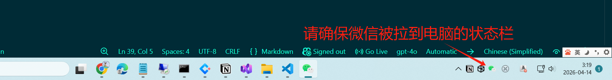

# FAQ

## ❓ 运行WechatAuto.sdk的示例自动化不了微信客户端？
回答：请按下面的步骤检查：
- 是否安装的是3.9.12.xx版本
> 如果安装不上，可以参见链接： 👉 [微信3.9.12.xx安装器 - 微信低版本安装](https://github.com/scottfly189/WeChatAuto.SDK/issues/2)
- 是否将微信拖到任务栏
  如下图所示:
  
- 检查windows版本，win10与win11可以运行;
- 如果经过上面的步骤还不行，请联系作者，并将你的代码发给他看;

## ❓ WechatAuto.sdk可以直接运行吗？
回答：不行，这个是一个SDK开发包，需要整合在你的项目中使用，如果你要运行，可以:
1. 运行仓库里的demo01,demo2项目
2. 下载wechatauto.sdk web support,提供UI界面供使用

下载链接： [下载](https://github.com/scottfly189/WeChatAuto.SDK/releases/tag/1.2.8)

## ❓ 请问WechatAuto.sdk有详尽的文档吗？
回答： 有详尽文档，但仅限于vip使用，作者是这样考虑的：
WeChatAuto.SDK的核心代码vip与非vip平权,不存在任何差别，但是作者基于WechatAuto.SDK做的应用（包括手机端微信自动化）、文档、视频等仅供VIP独享;
这个....您理解吗？😂

## ❓ 请问WeChatAuto.SDK支持最新版的微信吗？
回答：作者是这样计划：
提供两个版本WeChatAuto.SDK供使用：
- 一个是绝版的3.9.12.xx的微信客户端SDK: 由于是绝版，所以UI Tree等不会做更大的改动，这个更稳定，强烈建议用户使用，因为就是有bug,而每解决一个bug，就是一个长期稳定版本;
- 一个一直支持最新的微信客户端SDK:此SDK会一直追踪微信客户端最新的版本,目前在开发中;

